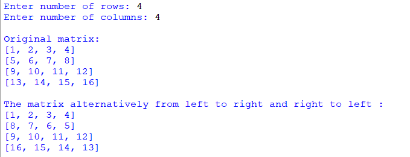

## Description
This program allows users to create a matrix and displays it in its original form. Following that, it alternately displays the matrix from left to right and right to left. 
The matrix is filled with sequential values starting from 1 up to the product of the specified number of rows and columns.
## Example

